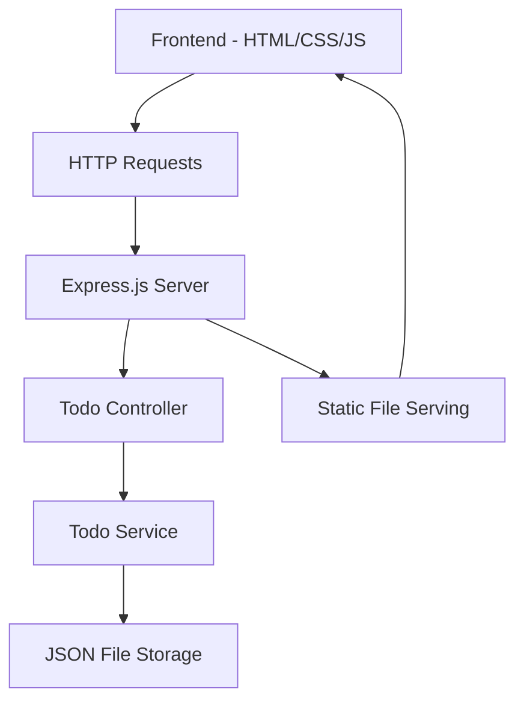

# Design Document

## Overview

The fullstack Todo application will be built using a client-server architecture with a Node.js Express backend serving RESTful APIs and a vanilla HTML/CSS/JavaScript frontend. The application will use in-memory storage initially (with JSON file persistence) for simplicity, making it easy to set up and run without external dependencies.

## Architecture



The application follows a layered architecture:
- **Presentation Layer**: HTML/CSS/JS frontend
- **API Layer**: Express.js REST endpoints
- **Business Logic Layer**: Todo service with validation
- **Data Layer**: JSON file-based persistence

## Components and Interfaces

### Backend Components

#### 1. Express Server (`server.js`)
- Main application entry point
- Configures middleware (CORS, JSON parsing, static file serving)
- Sets up API routes
- Handles server startup and error handling

#### 2. Todo Controller (`controllers/todoController.js`)
- Handles HTTP requests and responses
- Input validation and sanitization
- Error handling and status code management
- Routes:
  - `GET /api/todos` - Retrieve all todos
  - `POST /api/todos` - Create new todo
  - `PUT /api/todos/:id` - Update existing todo
  - `DELETE /api/todos/:id` - Delete todo

#### 3. Todo Service (`services/todoService.js`)
- Business logic for todo operations
- Data validation and transformation
- Interaction with storage layer
- Methods:
  - `getAllTodos()`
  - `createTodo(description)`
  - `updateTodo(id, updates)`
  - `deleteTodo(id)`
  - `toggleComplete(id)`

#### 4. Storage Service (`services/storageService.js`)
- File-based data persistence using JSON
- Atomic write operations to prevent data corruption
- Methods:
  - `loadTodos()`
  - `saveTodos(todos)`
  - `initializeStorage()`

### Frontend Components

#### 1. Main Application (`public/js/app.js`)
- Application initialization and state management
- API communication using fetch()
- DOM manipulation and event handling
- Error handling and user feedback

#### 2. Todo Manager (`public/js/todoManager.js`)
- Todo-specific operations and UI updates
- Form handling and validation
- Dynamic DOM updates for todo list
- Methods:
  - `renderTodos(todos)`
  - `addTodo(description)`
  - `editTodo(id, description)`
  - `toggleTodo(id)`
  - `deleteTodo(id)`

#### 3. UI Components (`public/js/ui.js`)
- Reusable UI utilities
- Modal dialogs and notifications
- Form validation helpers
- Loading states and error displays

## Data Models

### Todo Model
```javascript
{
  id: string,           // Unique identifier (UUID)
  description: string,  // Todo description (1-500 characters)
  completed: boolean,   // Completion status
  createdAt: Date,     // Creation timestamp
  updatedAt: Date      // Last update timestamp
}
```

### API Response Models

#### Success Response
```javascript
{
  success: true,
  data: Todo | Todo[],
  message?: string
}
```

#### Error Response
```javascript
{
  success: false,
  error: string,
  details?: object
}
```

## Error Handling

### Backend Error Handling
- Input validation errors (400 Bad Request)
- Resource not found errors (404 Not Found)
- Server errors (500 Internal Server Error)
- File system errors with graceful degradation
- Structured error responses with consistent format

### Frontend Error Handling
- Network error handling with retry mechanisms
- Form validation with real-time feedback
- User-friendly error messages
- Loading states during API calls
- Offline detection and messaging

### Error Recovery Strategies
- Automatic retry for transient network errors
- Local state preservation during errors
- Graceful degradation when backend is unavailable
- Data validation on both client and server sides

## Testing Strategy

### Backend Testing
- Unit tests for service layer using Jest
- Integration tests for API endpoints
- Error scenario testing
- File system operation testing
- Input validation testing

### Frontend Testing
- Unit tests for utility functions
- DOM manipulation testing
- API integration testing
- User interaction simulation
- Cross-browser compatibility testing

### Test Structure
```
tests/
├── backend/
│   ├── unit/
│   │   ├── todoService.test.js
│   │   └── storageService.test.js
│   └── integration/
│       └── todoController.test.js
└── frontend/
    ├── unit/
    │   ├── todoManager.test.js
    │   └── ui.test.js
    └── integration/
        └── app.test.js
```

## Security Considerations

### Input Validation
- Server-side validation for all inputs
- XSS prevention through proper escaping
- SQL injection prevention (not applicable with JSON storage)
- Input length limits and sanitization

### CORS Configuration
- Proper CORS headers for development
- Restricted origins for production deployment

### Data Sanitization
- HTML entity encoding for user inputs
- Trim whitespace and normalize data
- Prevent script injection in todo descriptions

## Performance Considerations

### Backend Optimization
- Efficient JSON file operations
- Minimal memory usage for todo storage
- Proper HTTP caching headers
- Gzip compression for responses

### Frontend Optimization
- Minimal DOM manipulations
- Debounced user inputs
- Efficient event delegation
- Lazy loading for large todo lists

## Deployment Architecture

### Development Setup
- Single Node.js process serving both API and static files
- File-based storage for simplicity
- Hot reload for development

### Production Considerations
- Environment-based configuration
- Proper logging and monitoring
- Database migration path (future enhancement)
- Static file serving optimization